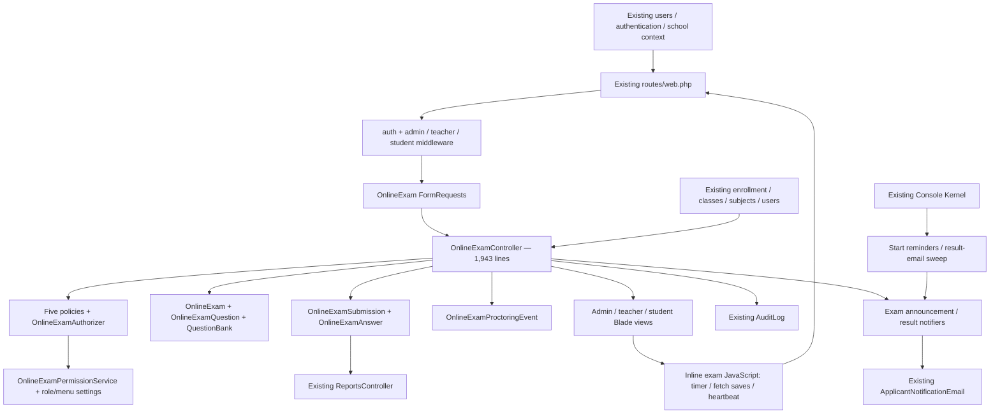

# PIIE Online Examinations — inspection audit
Date: 19 September 2026. Scope: the existing integrated Laravel application. **Inspection only; no exam implementation or migrations applied.**

## Evidence and limits
The live database is `piie_main` on MariaDB 10.4.32. All seven exam/question-bank tables contain **zero rows**. There are five users, one school, one academic session, and no student/enrollment/subject/programme records. Consequently, there is no real candidate history to audit and no populated live exam to certify. The earlier PIIE setup remains intact.

The existing Online Exam PHPUnit suite ran with the installed SQLite extensions enabled **for that command only**: **49 tests, 113 assertions, all passed**. The initial run failed before assertions because PDO SQLite was disabled; that was an environment problem, not 49 application failures. These tests build a simplified in-memory SQLite schema; they do not validate MariaDB constraints, real concurrent requests, or browser JavaScript.

Additional temporary in-memory HTTP/model probes reproduced the defects documented below. They used the existing test helper and never populated or migrated the live database. Their results are preserved in [runtime-probes.json](runtime-probes.json) and [additional-probes.json](additional-probes.json). No external messages or emails were sent. PHP test execution may write ordinary local logs/compiled views.

Artifacts:
- [Complete capability matrix](gap-matrix.md), also [CSV](gap-matrix.csv): each requested capability has a classification, evidence, files, tables, working behavior, gap, risk, recommendation and priority.
- [Live schema, indexes and DDL](live-schema.json): 27 inspected tables, including authoritative integration tables.
- [Registered exam routes](routes.json).
- [Existing test output](existing-tests.txt) and [JUnit results](existing-tests.xml).
- [Core source inventory](core-search-files.txt) and [broad concept search inventory](concept-search-files.txt). The broad search includes false positives such as framework-style test assertions, payment results and staff appraisals; those are not alternate Online Exam implementations.

Classification: IMPLEMENTED means a bounded capability has a connected implementation, supported where stated by existing tests; it does **not** certify the entire user journey. PARTIAL means connected but materially incomplete. BROKEN means a demonstrated failure or direct contract contradiction. PLACEHOLDER means a field/UI label/policy exists without the required behavior. MISSING means no implementation found in the inspected first-party application. RUNTIME VERIFICATION REQUIRED is reserved for behavior that source/test evidence cannot establish. Priorities are CRITICAL, HIGH, MEDIUM and LOW.

## A. Existing architecture map

There is one integrated module, not a separate application. Most orchestration is concentrated in `app/Http/Controllers/OnlineExamController.php`; exam-specific support services presently cover permissions and email, not attempt/grading transactions. Student JavaScript lives inside Blade, not a standalone exam frontend.

**Routes:** `routes/web.php:1313–1398` contains admin, teacher and student exam routes. Admin routes use `auth, admin`; that middleware admits several staff roles, so action policies are essential. Student routes use `auth, student`; teacher routes use `auth, teacher`. There is no dedicated Online Exam API in `routes/api.php`; start/save/heartbeat/proctoring are JSON responses on session-authenticated web routes.

**Models:** `OnlineExam`, `OnlineExamQuestion`, `QuestionBank`, `OnlineExamSubmission`, `OnlineExamAnswer`, `OnlineExamProctoringEvent`, `OnlineExamNotification`. A submission is the attempt; do not introduce a competing attempt identity.

**Validation/policies:** ten FormRequests in `app/Http/Requests/OnlineExam/`; five model policies registered by `AuthServiceProvider`; `OnlineExamAuthorizer` and `OnlineExamPermissionService`. No QuestionBank policy exists.

**Interfaces:** nine admin exam views, thirteen teacher exam views, four student exam views. Student exam views currently extend `admin.navigation`, despite an existing student navigation shell. The admin show controller references a nonexistent `admin/online_exam/show.blade.php`. Teacher `mark_answer.blade.php` is only a link back to the queue.

**Notifications/scheduling:** `OnlineExamAnnouncementNotifier`, `OnlineExamResultNotifier`, `SendOnlineExamStartReminders`, `SendOnlineExamResultEmails`; both commands scheduled every five minutes in `app/Console/Kernel.php`. No exam-expiry sweeper, exam-specific queued jobs, websocket invigilator feed, recording pipeline, or exam domain events were found. No first-party Online Exam JavaScript implementation was found under `public` or `resources/js` beyond the inline Blade scripts.

**Adjacent examination code:** offline `Exam`/`ExamCategory`, `Grade`/`Gradebook`, `AdmitCard`, and examination/marks views in AdminController, TeacherController, StudentController, ParentController and CommonController are separate existing academic functions. Assignment questions/submissions and staff appraisal questions are different concepts, not reusable Online Exam attempts.

## B. Existing database/schema map
All seven exam tables use an auto-increment unsigned bigint `id` primary key. **None declares a foreign-key constraint in the live database.** The references below are logical relationships, not enforced foreign keys. Full column types, nullability, defaults, indexes and CREATE TABLE statements are in live-schema.json.

| Table | Logical references and model relationships | Purpose / used by | Existing integrity |
|---|---|---|---|
| online_exams | school_id → schools; subject_id → subjects; class_id → classes; created_by/creator_id/updater_id/reviewed_by → users. OnlineExam belongsTo subject, classRoom, creator, updater, reviewer; hasMany questions, submissions, notifications. No school/session/programme relationship on model. | Exam configuration; all three portals, policies, reminders, reports. | Indexes: school, workflow, creator, updater, reviewer. No FK; no session/programme columns. |
| question_banks | school_id → schools; subject_id → subjects; created_by → users. QuestionBank belongsTo subject, creator. | Reusable source question; admin CRUD, teacher browse/import. | Only PK and school index. No lifecycle/version table. |
| online_exam_questions | online_exam_id → online_exams; nullable question_bank_id → question_banks. OnlineExamQuestion belongsTo exam, questionBank; hasMany answers. | Exam-owned copy of question text/options/key/marks. | Exam index; no FK, no bank index, no immutable version. |
| online_exam_submissions | online_exam_id → online_exams; student_id → users; school_id → schools. OnlineExamSubmission belongsTo exam/student; hasMany answerRows/proctoringEvents. | Attempt identity, deadline, scores, status, browser/IP data. | Nonunique exam/student/attempt and exam/student/status indexes; token index; **no unique attempt number**. |
| online_exam_answers | submission_id → submissions; question_id → questions; marked_by → users. OnlineExamAnswer belongsTo submission/question/markedBy. | One current answer and current mark per question/attempt. | UNIQUE(submission_id, question_id), separate indexes. No cross-exam invariant/FK; no answer revision history. |
| online_exam_proctoring_events | submission_id → submissions; reviewed_by → users. OnlineExamProctoringEvent belongsTo submission/reviewer. | Candidate-reported events, metadata and dormant review fields. | Indexes on submission, event type, reviewer, review status. No event dedupe key or composite timeline index. |
| online_exam_notifications | school_id → schools; online_exam_id → online_exams. OnlineExamNotification belongsTo exam. | Per-exam 24h/1h reminder ledger; not a recipient inbox. | UNIQUE(exam,type), school/exam indexes; no FK or per-recipient delivery state. |

Authoritative related tables:

| Table / key | Model | Relevant relationship / current use |
|---|---|---|
| users.id | User | Candidate is role 7 in current middleware and seeds; student_id references this table. No separate students table is needed. |
| schools.id | School | Tenant and running_session; current exam queries use authenticated user.school_id. |
| roles.role_id | Role | Actual PK is role_id; model still inherits id convention. Current seven role rows agree for roles 1–7. |
| departments.id | Department | Programme and staff grouping; exam can derive department through subject/programme. No direct exam integration. |
| programmes.id | Programme | Existing tertiary programme; subject.programme_id and StudentProfile.programme_id are authoritative. Not used by candidate eligibility. |
| classes.id / sections.id | Classes / Section | Legacy class/section academic structure. Online exam targets optional class only. |
| subjects.id | Subject | Existing class or programme course unit. Exam subject validation uses school; bank subject validation does not. |
| sessions.id | Session | School academic session. No online_exam.session_id; teacher UI is disabled placeholder. |
| enrollment.id | Enrollment | Actual table is singular enrollment. user/class/section/school/session references; Online Exams takes first student/school row without session filtering. |
| student_profiles.id | StudentProfile | Unique user_id; programme/intake/status for tertiary students. Ignored by exam eligibility. User FK cascades profile deletion, programme/intake FKs set null. |
| teacher_permissions.id | TeacherPermission | Legacy class assignments, marks/attendance flags. Teacher exam options use class assignments, not the marks flag. |
| teacher_programme_assignments.id | TeacherProgrammeAssignment | UNIQUE(teacher,programme,school). Permission service consults it for classless subjects, but teacher subject selectors do not. |
| exams.id / exam_categories.id | Exam / ExamCategory | Existing offline examination identity/category; do not confuse with online_exams.id. |
| gradebooks.id / grades.id | Gradebook / Grade | Existing school/session/student academic marks and grade definitions. No online result publication bridge. |
| routines.id / daily_attendances.id | Routine / DailyAttendances | Timetable and academic attendance. No current exam synchronization. Exam heartbeat is not classroom attendance. |
| audit_logs.id | AuditLog | Shared audit sink. Exam controller records selected action descriptions; not immutable mark/version history. |

The schema includes legacy duplicate spellings outside this module (`daily_aatendance` and `daily_attendances`); do not expand scope to rewrite them. Inspect consumers before any future integration.

## C–G. Real workflows traced
These classifications apply to whole workflows; a passing endpoint test is not proof of a complete browser journey.

| # | Workflow | Status | Evidence and actual behavior |
|---|---|---|---|
| 1 | Administrator creates/manages exam | PARTIAL | Store/update/modal/list exist; subject is required. Direct published state bypasses readiness; show page 500; GET mutations. |
| 2 | Lecturer creates questions | PARTIAL | Five types accepted in teacher form/request; MCQ tests pass. Fractional marks conflict with integer storage; nested edit/delete forms need browser verification. |
| 3 | Attach/select questions | PARTIAL | Teacher import copies bank text/options/key/marks and preserves source ID; tested snapshot independence. Admin loads bank but provides no import UI/action. Teacher standalone bank URL is 404. |
| 4 | Assign exam | BROKEN | Class eligibility works for first enrollment; null class means every student in school, including wrong-programme or unenrolled students. No session/programme/section assignment. |
| 5 | Student discovers exam | PARTIAL | Published same-school/class list and start/resume/result buttons tested. N+1 queries, broad null-class audience and latest-attempt-only history. |
| 6 | Start exam | PARTIAL | Permission, school, class, window, attempt count and client readiness flags checked. No authoritative programme eligibility or trusted device binding. |
| 7 | Create attempt | PARTIAL | Transaction locks exam and active attempt; deadline persisted. All candidates serialize on exam row; no unique attempt constraint. |
| 8 | Deliver questions | PARTIAL | School/attempt checks; keys blanked in take/preview; stable per-attempt CRC32 ordering tested. Entire paper delivered at once; no immutable candidate manifest. |
| 9 | Answer questions | PARTIAL | Radio MCQ/T-F and textarea short/essay/fill blank. No advanced question types, mark-for-review or enforced sequential mode. |
| 10 | Save answers | BROKEN | Server ownership/question/deadline checks, row lock and answer uniqueness are good. Client acknowledgement can discard newer dirty edits; blank clearing rejected; all 422 errors treated as terminal. |
| 11 | Enforce timer | PARTIAL | Server expires_at = min(start+duration, closing time); late saves rejected and refresh does not reset time. Browser display can drift; boundary is not rechecked after start lock; timezone contract ambiguous. |
| 12 | Manual submit | BROKEN | Actual finalSubmitForm sends CSRF only; required submission_id missing → reproduced HTTP 403. No save flush before navigation. |
| 13 | Automatic timeout | PARTIAL | JS posts timeout and expired take GET calls same finalizer; existing test passes. No background finalization while candidate is offline/closed. auto_submit toggle is not honored by client. |
| 14 | Objective marking | PARTIAL | MCQ and T/F exact normalized option comparison on saved rows. Admin T/F form stores “a” instead of true/false; bad keys not rejected. |
| 15 | Manual marking | BROKEN | Bounded partial marks, marker/time/comment work in tests. Marking active attempts is permitted and changes status, stopping candidate saves; admin finalizes unmarked work. |
| 16 | Calculate results | PARTIAL | Objective + manual score and raw-mark pass threshold. Marks/key schema limitations; unanswered written questions have no row; marking recompute always sees written questions as pending. |
| 17 | Publish results | BROKEN | immediate/after_exam_end/manual exist; manual equates finalized with published. Objective-only attempts auto-finalize; no independent release approval. |
| 18 | Student sees results | BROKEN | Own-submission policy and score page exist. In-progress result URL returned 200; partial/unfinished results can show pass/fail; hidden-policy submit redirects to forbidden result page. |
| 19 | Academic-record integration | PARTIAL | ReportsController reads submissions. Gradebook/transcript mapping is absent; reports use nonexistent submission.total_marks and yield wrong totals/percentages. |
| 20 | Proctoring record/review | PARTIAL | Tab/fullscreen events, IP/UA and paginated timeline. Camera only on readiness page; no recording/evidence or review decision persistence. |

**Student sequence:** list → instructions/readiness → POST start → GET take → fetch save-answer + heartbeat/events → submit or timeout → result. The browser submit contract and network safety break this chain even though individual server tests pass.

**Lecturer sequence:** class-assigned subject selection → draft → questions/import → preview → submit-review → permitted publish → attempts/marking/finalize. Tertiary-only teacher dropdowns are empty; update FormRequest casts a bound OnlineExam object to int (reproduced 500). A teacher can use the broader admin question-bank delete endpoint against another author's same-school question (reproduced).

**Administrator/examination office:** school admin has broad permission. Admin list/modal/questions/submissions/results/proctoring exist. Current role 19 has view/proctoring permission fallbacks, but policies additionally demand ownership/edit rights, preventing ordinary examination-officer attempt access. Superadmin has permission-service grants but null school context and exclusion from AdminMiddleware's staff-role list; it is not an institution examiner session.

**Grading flow actually implemented:** in_progress → finalized (objective-only) OR pending_manual_marking (any saved written answer); manual re-computation → pending_manual_marking; finalize endpoint → finalized. “submitted” and “timed_out” constants exist but the normal finalizer does not preserve them as separate stages; timeout is stored as submitted_via/timeout_at. There is no auto-marked → moderated → approved → published pipeline.

**Proctoring flow:** instructions page asks for video access/fullscreen → start trusts boolean flags → take page logs tab/fullscreen events → administrator timeline highlights certain event types. No trusted observation, live invigilator feed or automatic cheating decision was found.

## H. Complete gap matrix
See [gap-matrix.md](gap-matrix.md) or filter [gap-matrix.csv](gap-matrix.csv). It covers all 20 target categories, question types, listed sub-capabilities and the real workflow defects. Evidence IDs below resolve to exact existing files. Missing-feature rows identify the nearest existing component to extend, not a fictional implementation.

## I. Critical and security-sensitive findings
**F01 — CRITICAL: candidate answer loss.** take.blade.php saveQuestion captures an old value, then unconditionally clears dirtyQuestions on success. A candidate edits again while the request is in flight; the old acknowledgement marks the newer answer saved and the 10-second sweep skips it. There is no durable local draft queue. Final submit/timeout immediately navigates without awaiting saves. Closing/crashing/offline timeout can lose unsent work. Fix versioned acknowledgements, local pending drafts, retry/reconciliation, visible save status and an explicit flush/finalization protocol.

**F02 — CRITICAL: result-state safety.** isResultVisibleFor returns true immediately without requiring submission/grading completion. Manual policy returns true on finalized, which objective grading sets automatically. Admin finalizeResult lacks the teacher's unmarked-answer guard; UI disabling is not authorization. Both manual-mark paths can act on active work. Verified: active result HTTP 200, unmarked admin finalization succeeds, marking active work changes its status. Introduce separate attempt, marking and publication transitions; refuse active marking and incomplete approval. This is premature/provisional result exposure, not demonstrated answer-key leakage to students.

**F03 — HIGH: incorrect eligibility.** Null-class exams deliberately match all school students, not enrolled students of the subject's programme. No session/profile/intake checks; first enrollment may be historic. Implement one eligibility resolver over existing authoritative records, including an explicit “school-wide” choice. Never infer school-wide from missing class.

**F04 — HIGH: authorization gaps and role confusion.** Bank create/delete are governed by exam-create permission; teacher deletion of an admin-authored school bank question is reproduced. Cross-school bank subject references are accepted. Menu “online exams” grants many mutation permissions; deny entries (!permission/-permission) are not honored by runtime fallback. Examiner/auditor permissions depend on edit capability. The shared EnhancedSettingsController permission screen queries roles.school_id, a column absent from the live roles table; its permission settings use global role_perm_ID keys rather than tenant-specific keys. This is a connected configuration defect, not a reason to redesign all roles during exam repair. Define action-specific bank policies and deny precedence locally; resolve whether role permissions are platform-wide or institutional before changing persistence/defaults.

**F05 — HIGH: unsafe publication and structure transitions.** Admin store/update accept published workflow state without readiness; admin publish is a toggle that unpublishes exams with attempts, bypassing unpublish policy. Teacher submit-review can similarly transition an already attempted exam absent a source-state guard. Candidate take/manual-submit depends on exam still being published, while save/heartbeat use submission identity: cancellation/unpublication can strand an active candidate while still accepting saves. Put all transitions behind one locked transition service.

**F06 — HIGH: CSRF-sensitive GET mutations.** Admin publish/unpublish/delete exam/delete question/delete bank question use GET. Laravel web CSRF protection does not protect those mutations. Use POST/PATCH/DELETE, preserve names where practical, and make legacy GET safe confirmation/read-only or return 405. Browser prefetch or links must not change exam state.

**F07 — HIGH: no authoritative browser/session binding.** Server generates browser_session_token but never verifies it on saves/heartbeat/submission. Multiple browser sessions can operate the same attempt. Start camera/fullscreen flags are client claims. These are not lockdown controls.

**F08 — HIGH: proctoring integrity and privacy.** Event time and metadata are candidate supplied, weakly bounded, with no exam-specific throttle or dedupe. No durable offline event queue or immutable review trail. Do not interpret missing events as innocence or flags as cheating. Restrict payload size, record server receipt time, implement authorized human review and retention before evidence capture.

**F09 — HIGH: live/test schema mismatch.** Live question marks are signed tinyint; form accepts fractional/large numeric values and models cast integer. Live keys are varchar(5); FormRequests accept 255 characters. SQLite helper uses wider strings and different numeric shapes. Existing tests can pass while live database rejects/truncates content.

**F10 — HIGH: teacher edit and bank browsing broken.** UpdateOnlineExamRequest:23 casts route-bound exam object; question-bank static route follows /{exam}; admin show view absent. These are reproduced, not speculative.

**F11 — MEDIUM/HIGH: email reliability and concurrency.** Notifications send synchronously. Reminder ledger is inserted after sending, contrary to its migration comment; zero/partial sends still mark whole window delivered, overlaps can send twice before uniqueness rejects a ledger insert. Result email timestamp also follows send without claim lock. Teacher publish/finalize omit notifier calls used by admin; after_exam_end sweeper does not repair missed immediate/manual notifications. SMTP is currently unconfigured; external delivery unverified.

**F12 — HIGH: admin T/F grading defect.** The modal submits hidden MCQ correct_answer plus correct_answer_tf. Request normalizes only correct_answer; reproduced stored key “a” for T/F=true. Student submits “true”/“false”, so a valid answer cannot match. Share one canonical key control/validation across forms.

No raw student-supplied SQL was found in the exam controller queries; Eloquent scopes bind values. Exam text and answer views use escaped Blade output. These are useful protections, not a complete SQL injection/XSS penetration-test certification. JSON event metadata has no file upload pipeline; dangerous execution of uploaded exam files is currently absent because such question types are absent.

## J. Data integrity and concurrency
1. No live exam FKs: deletions elsewhere can orphan school/student/exam/question/marker links. There are currently no exam rows, so observed orphan count is necessarily zero; that does not prove protection.
2. Preserve audit records: prefer RESTRICT for historical exam/attempt/question/user references; use explicit archival/anonymization policies. Do not add blanket cascades. Existing StudentProfile cascades only explain upstream identity loss risk; do not rewrite that module during engine repair.
3. Unique answer pair is good. Add unique(exam, student, attempt_no) after duplicate preflight; a plain index is insufficient. Retain transaction guards for one active attempt—uniqueness of attempt number alone does not ensure one active status.
4. Current exam row lock serializes starts across the entire cohort. Measure MariaDB concurrent starts before changing lock granularity; use candidate-scoped allocation plus constraints, with consistent lock order.
5. Structural edit/delete guards mostly run before writes without locking the same exam row as start; concurrent start/edit/delete can defeat snapshots/readiness. Locks must cover invariant checks and mutation in one transaction.
6. Marking updates are transactional but do not serialize totals on the submission row. Concurrent markers can overwrite totals; teacher pending-check is outside finalization lock. Re-read fresh answer rows inside a consistent submission lock.
7. Question bank import snapshots source content, but candidate delivery reads mutable exam questions. Stable shuffling is not full reproducibility. Persist immutable paper/question/key versions, question/option order, grading rules, total/pass threshold and eligibility/time context per attempt.
8. Duplicate representations: created_by vs creator_id; workflow_state vs is_published; legacy submissions.answers vs online_exam_answers; stored score vs objective/manual/effective_score. Keep compatibility readers while selecting one authoritative write path; never bulk-delete legacy data.
9. Constraints to consider additively: marks >= 0 with suitable DECIMAL precision, positive duration/attempt limit, valid key option, valid state transitions, matching submission/question exam, school-consistent references, immutable submitted_at. Nullable class is legitimate for programme-based exams; it must not imply universal eligibility. Draft subject/schedule/creator nullability needs explicit draft rules; historical rows need migration preflight/backfill, not blind NOT NULL.
10. Candidate indexes to validate with EXPLAIN/load data: exams(school,workflow,start/end), submissions(status,expires_at), submissions(school,student,exam), question ordering(exam,sort_order,id), bank(school,subject,created_by), events(submission,event_time,id), notification recipient/dispatch indexes if redesigned.
11. Live score is DECIMAL(6,2), component scores DECIMAL(8,2); maximum mark rules need consistency. Key length and signed tinyint marks are confirmed live incompatibilities.
12. Runtime app timezone is UTC while earlier school/global setting says Africa/Nairobi. Scheduling inputs are timezone-free datetime-local; API mixes offset-free strings with ISO output. Define and test an explicit UTC storage/institution display contract without globally changing all modules.
13. Missing expiry worker leaves expired abandoned attempts in_progress indefinitely. Heartbeat updates last_activity even when expired/finalized; it is not a reliable “active” state.

## K. Safe integration map
| Existing source | Current integration | Safe target / ownership boundary |
|---|---|---|
| Users/authentication | Existing guard and users.student_id | Reuse User identity/auth; exam session binding belongs to exam attempt. |
| Roles/permissions | Existing policies and role/menu setting keys | Extend action permissions locally; retain middleware compatibility. No duplicate user-role system. |
| Schools | User school and scoped queries | Mandatory tenant resolver/scope for every exam child; explicit platform-admin institution context only if approved. |
| Departments/programmes/subjects | Subject selected; programme teacher permission partly consulted | Derive department from existing programme/subject; refer to existing IDs. Validate same-school and assignment. |
| Classes/sections/enrollment | Optional class; first Enrollment row | Resolve active session enrollment/section consistently; do not manufacture Enrollment for tertiary students. |
| StudentProfile/intake | Not used | Reuse programme/intake/status for tertiary eligibility. Snapshot eligibility decision, not duplicate student master data. |
| Academic sessions | Disabled selector | Add nullable backward-compatible exam session reference, enforce for new scheduled exams after setup/backfill. |
| Timetable/academic calendar | None | Optional read-only conflict detection/link to exam schedule. Keep exam window authoritative; no automatic timetable rewrite. |
| Attendance | None | Keep attempt/heartbeat separate. Optional audited export only with an agreed academic attendance policy. |
| Results/gradebook/student records | Read-only ReportsController | Publish approved result through small adapter/event with explicit category/subject/session/retake policy and idempotent source mapping. Do not insert grades until that mapping is approved. |
| Notifications | Shared mail template; exam reminder ledger | Reuse infrastructure, add per-recipient delivery/outbox semantics within exam module; no new general notification system. |
| Audit logs | Shared AuditLog::record | Continue shared audit; exam-owned append-only revisions/interventions supply structured context. Do not refactor all auditing. |

## L. Working parts to preserve
- Existing authentication and tenant-scoped exam/attempt lookups; tested cross-school and other-student denial.
- Server-held expiry, rejection of late saves, non-resetting resumed deadlines.
- Answer unique constraint plus submission lock during autosave/finalization.
- Start attempt count checks and transaction serialization until a measured replacement is tested.
- Correct-answer removal from take/preview payload, explicit validated write payloads and prohibited score injection.
- Stable per-attempt question/option ordering and bank-to-exam copy semantics.
- Publication total-marks consistency check on dedicated publish paths.
- Existing teacher ownership restrictions, marking upper/lower bounds, escaped question/answer output.
- Existing route names, five policies, current exam/submission IDs and all stored history.
- All 49 existing tests; augment rather than replace them with easier tests.

## M. Looks complete but is incomplete/broken
Fields/UI are misleading in several places: browser_session_token is not enforced; sequential-navigation and auto-submit switches are not implemented end-to-end; programme/session selectors are placeholders; “camera for duration” only checks readiness; “lost connection will not lose work” is false for unsent work; proctor review columns have no decision-writing workflow; fill-blank auto-grade input is validated but never used; admin results finalize button becomes disabled for pending_manual_marking even after all written marks because recompute does not detect completion; mark_answer page is a navigation placeholder; teacher question order form lacks ordering controls and nests forms; exam/results report totals read a nonexistent property.

## N. Missing functionality
The matrix enumerates each requested item separately. Major missing families: structured/versioned/moderated bank metadata, most advanced question types, pools/blueprints/balanced generation, immutable candidate paper, durable offline recovery, accommodations and audited extensions, separate result approval/publication, proper invigilator control room, incident/appeal case management, advanced psychometrics, secure recording/evidence handling and trusted lockdown integration. No AI cheating detector exists, and none should be added as an automatic adjudicator.

## O. Technical debt
- 1,943-line controller duplicates admin/teacher transitions, payload assembly, notification behavior and marking.
- Readiness checks are bypassable through alternate mutation endpoints.
- FormRequests inconsistently normalize route-bound objects.
- Role labels disagree: role 19 is Examinations in middleware/service but Admissions in AuditLog labels; AuditLog labels for several other extended roles also disagree with middleware/navigation. Current database only contains roles 1–7, so roles beyond seven are code-path evidence, not configured roles.
- Migration history, installer schema and simplified SQLite test schema diverge.
- No enum/value-object transition contract; unused status constants and overlapping flags.
- Legacy answers JSON and dual creator IDs remain without documented write authority.
- Blade embeds large JavaScript/state logic and nested forms; no browser automation suite covers submission/network behavior.
- Synchronous mail, unbounded cohort/question loads, missing indexes, ineffective delivery dedupe under concurrency.
- Audit descriptions omit old/new marks and immutable revision linkage; logging failure is intentionally swallowed by existing shared logger.

## P. Recommended target architecture
Keep all existing Laravel routes, identity/academic models and the OnlineExamSubmission attempt identity. Start with a few cohesive exam-owned services:
- **ExamEligibilityService:** one audience decision for discovery/start/notifications, reading Enrollment/StudentProfile/Subject/TeacherProgrammeAssignment.
- **AttemptService + ExamTimerService:** create/resume/finalize under consistent locking; deadline and optional extension policy; idempotent terminal transitions.
- **AnswerService:** typed validation, revision/sequence checks, durable acknowledgement contract, immutable post-submit behavior.
- **GradingService + ResultPublishingService:** objective grading/manual completion invariants and explicit release. Reuse existing policies; do not grant marker edit-all merely to view work.
- **ExamService** only for shared lifecycle/readiness/structure locking, replacing duplicated admin/teacher logic incrementally.
- Add **QuestionBankService** when versioning/import/moderation requires it, and **ProctoringService** when event validation/review/evidence lifecycle warrants it. No empty abstraction layer or duplicate repositories for every model.
- Use a small published-result adapter to existing academic records later; exam services should not call unrelated controllers.

Exam configuration states and attempt/marking/publication states must be separate. Do not retrofit every proposed high-stakes state before fixing the current engine. A small explicit state machine with tested transitions is sufficient for the first batch.

## Q. Implementation Phase 1 — dependable existing engine
This is a proposed implementation phase following this completed inspection; nothing below has been implemented.

**Batch 1 (recommended first approval): repair the current exam journey.**
1. Fix final-submit request contract; await save acknowledgements and preserve pending state on failed submit.
2. Fix teacher update binding, static question-bank route order, missing admin show view, T/F key controls and nested question forms.
3. Gate manual marking to submitted attempts, require all written marks before finalization, separate finalized from result-published, render pending/hidden outcomes correctly.
4. Consolidate publication readiness/source-state checks; prevent transition shortcuts and unsafe unpublish of active exams.
5. Replace exam-related GET mutations; add bank ownership/tenant authorization and explicit deny semantics.
6. Add failing regression/browser tests first for each reproduced defect.

**Batch 2: reliable attempts and recovery.**
Persist candidate paper/rules; version answers and acknowledgements; scoped local pending drafts with expiry/logout cleanup; retry with backoff/reconnect sync and clear status. Decide late offline-answer policy explicitly: untrusted client timestamps cannot prove an answer was written before deadline. Add server expiry sweeper and idempotent finalize receipt. Add suitable uniqueness/FKs/indexes after read-only compatibility preflight. Enforce device/session policy and rate/payload budgets. Test concurrent starts/save/submit/mark under MariaDB.

**Batch 3: correct integration and operations.**
Unify class/programme/session eligibility using existing records; reconcile examiner capabilities without global role rewrite; align timezone handling; paginate/eager-load hotspots; repair exam report adapter; reliable exam notification dispatch; structured exam audit context. Verify schedule runner operationally in deployment. Preserve current data and run connected-module regressions.

Acceptance: five-type basic exam can be created, reviewed/published, discovered by only intended candidates, started once, answered/reloaded/recovered, submitted manually or automatically, graded and deliberately released without losing acknowledged answers. Failed/repeated requests must not create extra attempts or corrupt totals.

## R. Implementation Phase 2 — bank, assessment quality and richer recovery
Versioned question bank with taxonomy, moderation, metadata, import/export and duplicate detection; typed question schemas and explicit grading rules; reproducible pools/blueprints; accessible navigation/review/sections; accommodations; marking rubrics, anonymous/double marking and reconciliation; mark/key revision and regrade history; delayed answer/feedback release; candidate attempt history; analytics over completed/published populations; incidents and appeals; approved academic-record publishing adapter. Recovery baseline is Phase 1, not deferred here—Phase 2 extends it to multi-device conflicts, exam sections and richer incident workflows.

## S. Implementation Phase 3 — high-stakes integrity
Role-scoped invigilator control room, audited emergency pause/resume/extra-time/termination/reopen; privacy-designed identity checks and optional webcam/audio/screen evidence; encrypted private object storage, retention/deletion policy, signed evidence access and chain-of-custody; approved secure-browser integration and compatibility testing. Automated signals are evidence for authorized human review, never automatic cheating findings. Provide alternative arrangements/accommodations and an appeal path. Browser JavaScript cannot prevent OS screenshots, other applications, phones or second devices.

## T. Exact expected Phase 1 change surface
Existing files proposed for scoped edits:
- `routes/web.php` — only OnlineExamController route block.
- `app/Http/Controllers/OnlineExamController.php`.
- `app/Models/OnlineExam.php`, `OnlineExamSubmission.php`, `OnlineExamAnswer.php`, `OnlineExamQuestion.php`, `QuestionBank.php`, `OnlineExamProctoringEvent.php`, `OnlineExamNotification.php` (all under app/Models).
- `app/Http/Requests/OnlineExam/StoreOnlineExamRequest.php`, `UpdateOnlineExamRequest.php`, `StoreOnlineExamQuestionRequest.php`, `UpdateOnlineExamQuestionRequest.php`, `StartOnlineExamRequest.php`, `SaveOnlineExamAnswerRequest.php`, `SubmitOnlineExamRequest.php`, `ManualMarkAnswerRequest.php`, `ProctoringEventRequest.php`, `CameraReadinessRequest.php`.
- `app/Policies/OnlineExamPolicy.php`, `OnlineExamSubmissionPolicy.php`, `OnlineExamAnswerPolicy.php`, `OnlineExamQuestionPolicy.php`, `OnlineExamProctoringEventPolicy.php`; new `app/Policies/QuestionBankPolicy.php` and its registration in `app/Providers/AuthServiceProvider.php`.
- `app/Support/Permissions/OnlineExamAuthorizer.php`, `OnlineExamPermissionService.php`; `database/seeders/OnlineExamPermissionSeeder.php` only if approved permission data needs additive defaults.
- All four `resources/views/student/online_exam/{list,instructions,take,result}.blade.php`.
- `resources/views/admin/online_exam/{index,modal,questions,question_modal,question_bank,bank_modal,submissions,results,proctoring}.blade.php`; new `show.blade.php`.
- `resources/views/teacher/online_exam/{_form,index,questions,question_form,question_bank,marking,results,attempts}.blade.php`.
- `app/Support/OnlineExams/OnlineExamAnnouncementNotifier.php`, `OnlineExamResultNotifier.php`; `app/Console/Commands/SendOnlineExamStartReminders.php`, `SendOnlineExamResultEmails.php`; exam schedule entries in `app/Console/Kernel.php`.
- Narrow exam-only consumers in `app/Http/Controllers/ReportsController.php` and `resources/views/admin/reports/exams.blade.php`.
- Existing seven OnlineExam test classes and `tests/Feature/Support/OnlineExamTestHelper.php`; browser/concurrency tests added separately.

Proposed new implementation paths (names are a design proposal, not existing files):
`app/Support/OnlineExams/{ExamService,ExamEligibilityService,AttemptService,ExamTimerService,AnswerService,GradingService,ResultPublishingService}.php`,
`app/Console/Commands/ExpireOnlineExamAttempts.php`,
`resources/js/online-exams/attempt.js`,
`tests/Feature/OnlineExamEngineRegressionTest.php`,
`tests/Feature/OnlineExamEligibilityTest.php`,
`tests/Integration/OnlineExamConcurrencyTest.php`,
`tests/Browser/online-exams.spec.js`.
Frontend build/test tooling changes only if required for this extracted asset/browser suite.

Expected tables:
- Alter additively: online_exams (session/programme/intake/audience and release rules); online_exam_questions/question_banks (safe marks/key types); online_exam_submissions (paper/rule snapshot, publication/marking state, unique attempt identity, receipt/session fields); online_exam_answers (revision/ack fields); online_exam_proctoring_events (receipt/dedupe/bounds); online_exam_notifications (reliable dispatch state).
- New only when justified: online_exam_attempt_questions (immutable delivered paper; preferred over giant JSON); online_exam_result_revisions (mark/release history); online_exam_notification_deliveries (per-recipient retry ledger). Avoid a new students/subjects/sessions/enrollment table.
- Read existing users/schools/roles/subjects/programmes/departments/classes/sections/sessions/enrollment/student_profiles/teacher assignment tables. Audit logs receive normal entries, not a schema rewrite. No gradebook mutation until its mapping is approved.

New additive migrations only, for example `YYYY_MM_DD_HHMMSS_harden_online_exam_integrity.php`, `..._add_online_exam_attempt_snapshots.php`, `..._add_online_exam_release_and_revision_state.php`, `..._add_online_exam_delivery_ledger.php`. Final timestamp/file split follows the approved batch. Existing historical migrations and unrelated modified files remain untouched.

## U. Regression risks and containment
| Risk | Prevention |
|---|---|
| Legacy exams change audience unexpectedly | Explicit audience migration/backfill report, old behavior compatibility until reviewed, new-exam validation. |
| Existing published/results history disappears | Additive columns, compatibility reads, no destructive resets/deletes; snapshot existing rows with provenance. |
| Role fixes broaden permissions across modules | Exam-local policy changes and role evidence; no global role-ID renumbering or wholesale middleware changes. |
| Academic gradebook gets duplicate/wrong results | No write integration in first batch; later source-keyed idempotent adapter with approved aggregation/retake policy. |
| Shared layouts break students | Change exam views to appropriate existing shell with navigation regression tests; do not redesign all layouts. |
| Timetable/attendance semantics polluted | Keep exam telemetry separate; no automatic academic attendance or scheduling writes. |
| Migration alters existing unrelated work | New migration files only; baseline diff/hashes, schema preflight, dedicated test DB, review each changed path. |
| Notifications block candidates | After-commit queue/outbox and mail fakes in tests; candidate transaction never depends on mail success. |
| Constraints fail on old data | Detect/report duplicates/orphans, explicit remediation plan and backup; never silently delete them. |
| Offline drafts leak on shared computers | Scope by user/attempt, bounded retention, clear after acknowledged completion/logout, never store answer keys. |

Modules that can remain entirely unchanged in the first implementation batch: admissions/applicant portal, fees/payment gateways/accounting, payroll/HR/leave/appraisals, library, hostel, transport, clubs, assets/procurement, website CMS, live classes, assignments, graduation, and underlying student/user/department/programme/class/subject/session/enrollment CRUD. Existing authentication is reused. Shared route/provider/scheduler/report files receive only narrowly identified exam changes.

## V. Testing strategy and approval gates
1. **Unit:** eligibility resolver for class/programme/session/intake; window boundaries, timezone conversion and deadline snapshots; all typed key validation/grading; publication state rules; mark range/rounding; deterministic snapshot reconstruction.
2. **Feature:** actual admin/teacher form payloads through create/edit/question/import/review/publish; all student flows; missing fields, invalid keys, blank-answer clearing, manual marking completion, hidden/published result views and notices.
3. **Authorization:** role/action matrix, question-bank author isolation, explicit-deny precedence, examiner/marker read versus edit rights, own/other candidate IDs, altered route/body IDs, school mismatch for every nested resource, suspended accounts.
4. **Timers:** before/exact start/exact close/late entry; browser clock drift and background throttling; refresh/reconnect; expired save/submit; sweeper with no browser; extension and clock changes where later supported.
5. **Autosave/browser:** real browser input/debounce, edit during in-flight save, out-of-order acknowledgements, blank clearing, navigation warning, final click with pending saves, failed submit, preserved dirty indicator.
6. **Network/retry:** offline then reload, browser crash/restart, slow/flapping connectivity, request accepted but response lost, 401/419/422/429/500, bounded backoff, dedupe/revision conflict, reconnect near/after deadline. Explicitly test accessibility of errors and save states.
7. **Duplicate submission:** manual/manual, manual/timeout, timeout/sweeper, retry after lost redirect; stable receipt/scores and exactly one terminal transition.
8. **Concurrency on MariaDB:** many candidates starting one exam; same candidate two starts; start versus structure edit/delete/publish; answer versus submit; two markers and finalize; overlapping reminder workers. SQLite cannot certify row locks.
9. **Grading:** true/false via actual admin form; MCQ absent/invalid option; written partial marks; unanswered written question; no active marking; incomplete finalize denied; corrected-key regrade history once built; no premature pass/fail.
10. **Tenant isolation:** two schools with overlapping role/class/programme situations; foreign subject/bank/attempt/event IDs and notification audiences; verify direct URL and crafted JSON denial.
11. **Connected regressions:** auth and navigation, user/student identity, enrollment and programme selectors, permissions, report totals, audit metadata, notification template rendering; unrelated modules' existing tests on isolated DB.
12. **Performance:** representative bank sizes and cohort starts; query counts, latency percentiles, deadlocks, server memory, request rates, expiry worker backlog and mail retries. Agree realistic cohort/SLA before claiming capacity.
13. **Accessibility:** keyboard-only, screen-reader labels/status announcements, zoom/high contrast, focus behavior, clipboard restrictions, reduced-distraction and accommodations.
14. **Operational/runtime:** production-like TLS/session config, scheduler invocation, queue workers and test mail sink, backups/restoration, log/evidence access and retention. Do not send test notifications to real recipients.

Release gates: preserve all current passing tests; reproduce and then fix every CRITICAL/HIGH issue in the approved batch; verify actual browser/manual and timeout completion with durable answers; prove tenant boundaries and MariaDB concurrency; review additive migration preflight; require an explicit publication action before exposing protected results.

## Approval conclusion
1. **Already works well:** integrated identities, many ownership checks, server deadlines, locked answer persistence, deterministic shuffling, copied bank questions, basic objective/manual grading components and 49 passing tests.
2. **Broken:** manual-submit form, teacher update, teacher question-bank URL, admin show, admin T/F key, safe marking/finalization, report totals, client dirty-state acknowledgements.
3. **Missing:** dependable offline persistence, expiry worker, immutable paper, programme/session eligibility, distinct approval/publication, advanced banking/marking/proctoring/control room/appeals.
4. **Dangerous:** answer loss, premature results, wrong candidate audience, permissive bank actions/ignored denies, GET mutations, live/test schema mismatch and unaudited race conditions.
5. **Build first:** current journey and security/data-loss fixes, then recovery/expiry/constraints—not AI proctoring.
6. **Integrate:** existing identity/auth/roles/schools, Enrollment/StudentProfile, subjects/programmes/classes/academic sessions, notifications/audit, and later approved academic results mapping.
7. **Leave untouched:** unrelated business modules and authoritative academic CRUD; narrow exam adapters only.
8. **Recommended first batch:** Q/Batch 1 with failing regression tests for the reproduced defects, followed immediately by durable recovery and authoritative timeout work.

**STOP: implementation awaits your approval. No feature fixes have been applied.**
